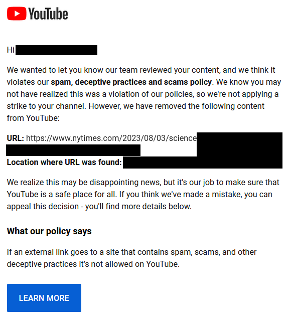

# Email Screenshot of Threat Received

# Text Copy of Email

Hi ████████████████████

We wanted to let you know our team reviewed your content, and we think it violates our spam, deceptive practices and scams policy. We know you may not have realized this was a violation of our policies, so we're not applying a strike to your channel. However, we have removed the following content from YouTube:

**URL**: `https://www.nytimes.com/2023/08/03/science`████████████████████████████████████████████████████████████████████████████████  
**Location where URL was found:** ████████████████████████████████████████████████████████████

We realize this may be disappointing news, but it's our job to make sure that YouTube is a safe place for all. If you think we've made a mistake, you can appeal this decision - you'll find more details below.

### What our policy says

If an external link goes to a site that contains spam, scams, and other deceptive practices it's not allowed on YouTube.
